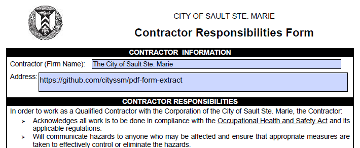

# PDF Form Extract

[](https://www.npmjs.com/package/@cityssm/pdf-form-extract)
[](https://app.codacy.com/gh/cityssm/pdf-form-extract/dashboard)
[](https://codeclimate.com/github/cityssm/pdf-form-extract)
[](https://codeclimate.com/github/cityssm/pdf-form-extract)
[](https://github.com/cityssm/pdf-form-extract/actions/workflows/coverage.yml)
[](https://app.snyk.io/org/cityssm/project/78ebff99-06fc-4153-a2c8-ccededba162e)

Extracts PDF form fields into a Javascript object.

## Installation

    npm install @cityssm/pdf-form-extract

## Usage



```javascript
import extractFormFields from "@cityssm/pdf-form-extract"

const data = await extractFormFields('test/testForm.pdf')
console.log(data)

const dataWithOptions = await extractFormFields('test/testForm.pdf', { useFieldName: true })
```

```json
{
  "Contractor Firm Name": "The City of Sault Ste. Marie",
  "Address": "https://github.com/cityssm/pdf-form-extract",
  "Contractor Representative Print Name": "Dan Gowans",
  "Date": "2023-01-13"
}
```

### Optional Options

**useFieldName**<br />
_Default = false_<br />
Uses the field name (provided by the Form API) as the Object key
instead of the field key.

## Notes

For the best results, the form fields in the PDF should be properly labelled.
